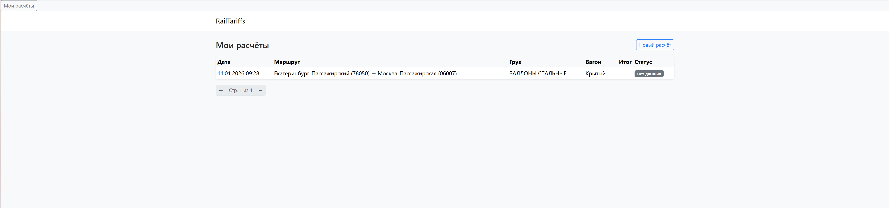
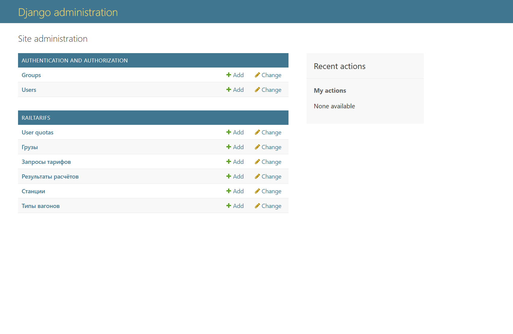
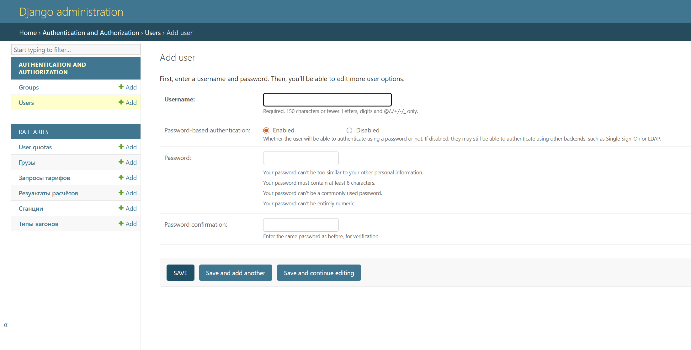
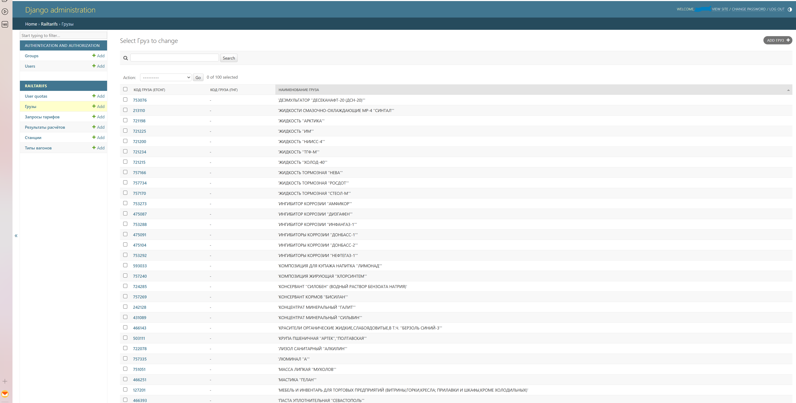

RailStakes - Система расчета железнодорожных тарифов
Профессиональный веб-сервис для расчета железнодорожных тарифов перевозок.
Платформа позволяет сотрудникам транспортных компаний быстро и точно рассчитывать стоимость перевозки грузов между станциями с использованием актуальных тарифов через интеграцию с внешним API. Система сохраняет историю расчетов, управляет квотами пользователей и предоставляет удобный интерфейс для работы со справочниками.

Ссылка на рабочий проект: [https://bbld10w010.pythonanywhere.com]

🚀 Технологии
Python 3.13

Django 6.0

В разработке использовался BDEngine PostgreSQL

На деплое используется предоставляемая бесплатно хостером MySQL

Requests 2.31+ - для HTTP-запросов к внешнему API

XML.etree.ElementTree - для парсинга XML-ответов от API

Django Templates - для рендеринга HTML

Dotenv - для управления переменными окружения

1. Главная страница - Расчет тарифа
Интерфейс формы расчета тарифа с автодополнением станций и грузов

2. История расчетов
Страница с историей всех расчетов пользователя с отображением статуса и стоимости

3. Панель администратора
https://screenshots/admin_panel.png
Интерфейс администратора для управления справочниками

📋 Функциональность
Для пользователей:
Расчет стоимости перевозки с учетом всех параметров

Автодополнение при выборе станций и грузов

Просмотр истории своих расчетов

Отслеживание оставшегося лимита запросов

Для администраторов:
Управление пользователями и их квотами

Редактирование справочников (станции, грузы, типы вагонов)

Просмотр статистики всех расчетов

Как запустить проект локально

1. Клонируйте репозиторий:
bash
git clone https://github.com/BBLD10W0-1010/RailStakes
cd rail-stakes

2. Создайте и активируйте виртуальное окружение:
bash
# Для Linux/Mac:
python -m venv venv
source venv/bin/activate

# Для Windows:
python -m venv venv
venv\Scripts\activate
3. Установите зависимости:
bash
pip install -r requirements.txt

4. Настройте базу данных, сохраните название бд, имя пользователя с правами на запись/чтение/редактирование, его пароль, адрес хоста/localhost, порт хоста
5. Настройте переменные окружения:
Создайте файл .env в корневой директории проекта:

    DB_ENGINE=django.db.backends.postgresql // либо ваш DB_ENGINE, прим. django.db.backends.mysql
    DB_NAME=rail_stakes // название вашей бд
    DB_USER=your_username // имя пользователя бд
    DB_USER_PASSWORD=your_password // пароль пользователя бд
    DB_HOST=localhost // адрес хоста
    DB_PORT=5432 // порт хоста
    ALTA_API_BASE_URL=https://www.alta.ru/rail_tracking/rail_trf/ //оставлять таким
    ALTA_API_KEY=your_api_key_here // Ваш ключ полученный от представителей Альта-софт, 32 символа, состоит из заглавных английских букв и цифр.

6. Выполните миграции:
bash
python manage.py makemigrations
python manage.py migrate
7. Создайте суперпользователя:
bash
python manage.py createsuperuser

Запомните данные
8. Загрузите начальные данные (опционально):
bash
# Для загрузки тестовых данных в справочники
python manage.py load_references.py

//В корне проекта находятся файлы - примеры того как данные должны выглядеть для загрузки в БД с помощью этого скрипта

9. Запустите сервер разработки:
bash
python manage.py runserver
10. Откройте проект в браузере:
Перейдите по ссылке: http://127.0.0.1:8000/

